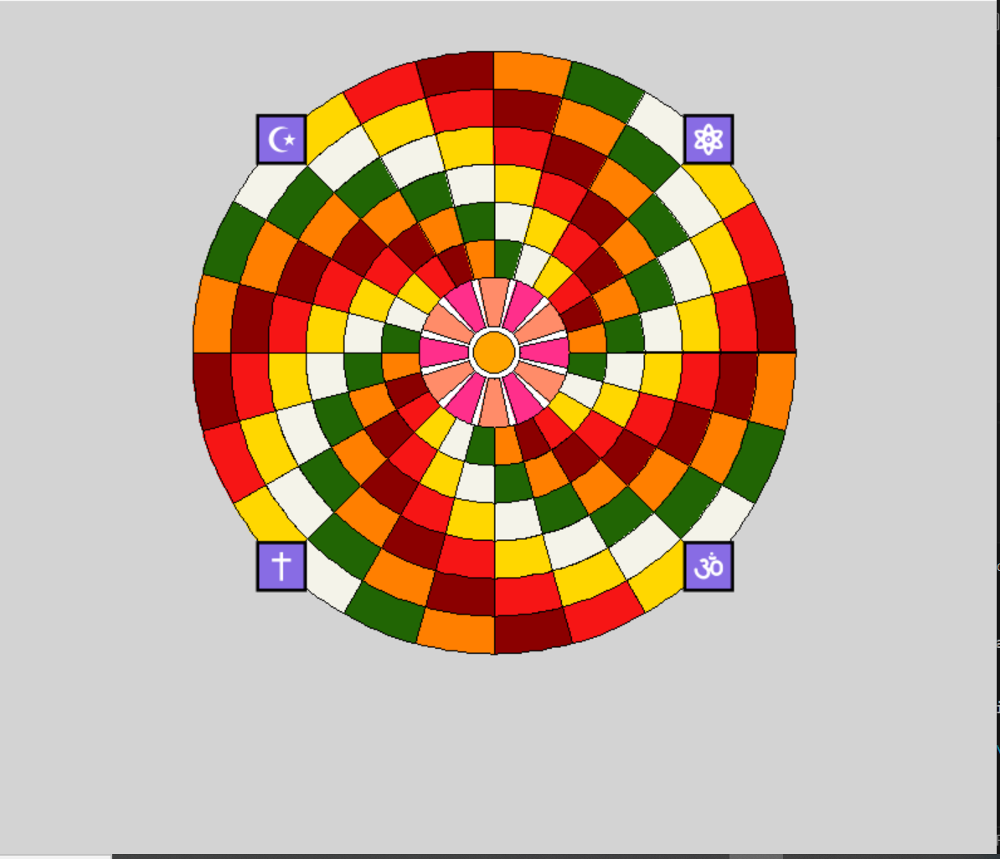
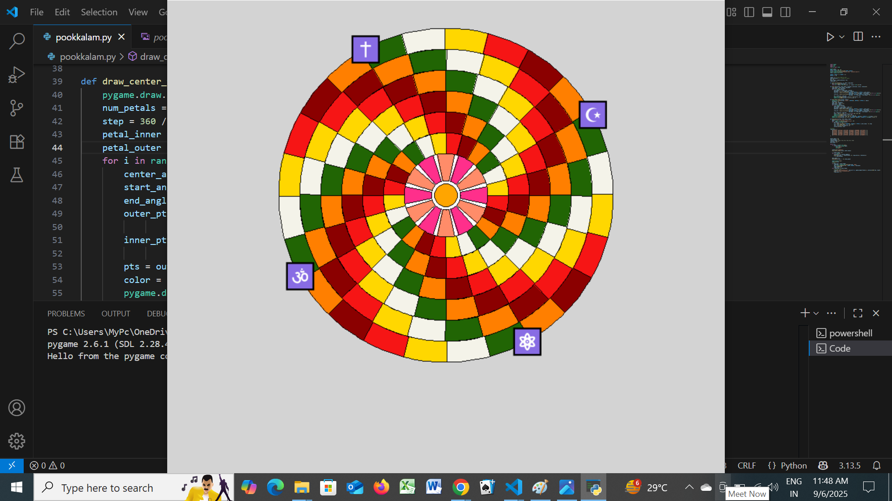

🌸 Niranjana's Pookalam 2025 🌸

👨‍💻 About Me

Name: Niranjana 
Institution: MBCCET, Peermade
GitHub: [@Niranjana2410](https://github.com/Niranjana2410)
Programming Language Used: Python 

 🎨 My Pookalam

Description:
Onam in Kerala feels like a season when the land itself comes alive, with stories of King Mahabali’s return woven into every smile and celebration. It’s not just a festival, but a homecoming of joy, where families gather, feast, and share in traditions that have lasted centuries.
✨
 At the heart of it all lies the pookkalam❇️, a breathtaking floral design that blooms at every doorstep.
It is a symbol of harmony, prosperity, and the warm welcome extended during Onam.

 In this design, six concentric circles represent the eternal cycle of life, unity and continuity, each carefully divided into square partitions that showcase colors arranged in balance and beauty. At the very heart rests a yellow centre circle, radiating brightness and positivity, surrounded by six pink petals symbolizing love, compassion, and the blossoming of joy. Together, the circles and petals weave a tapestry of tradition, where geometry and nature meet to create a vibrant expression of Onam’s spirit.The four symbols placed around the Pookkalam represent diverse beliefs and knowledge, coming together in harmony. Their circular arrangement celebrates unity, coexistence, and respect for all paths, reflecting how diversity can create beauty and balance, just like the colors and patterns of the Pookkalam.

 

Preview:
 - still view
-still view

For pookkalam animation : ├──https://youtube.com/shorts/2KzEKibx6nY

Features:

Feature 1 – Concentric Harmony:
The six circles spread outward reminding us of unity, continuity, and the ever-expanding joy of Onam.

Feature 2 – Geometric Beauty:
Each ring is divided into neat squares filled with vibrant shades, creating a balanced and visually pleasing flow of color

Feature 3 – Cultural Essence:
It blends traditional floral artistry with precise geometry, reflecting both Kerala’s rich heritage and the spirit of festive creativity.

Feature 4:
The Pookkalam includes four symbols around the innermost ring, representing diverse beliefs and knowledge.

🚀 How to Run:

Prerequisites:  

-Install Python 3.7+ from python.org.
-install pygame and imageio
-Save the file as pookkalam.py.
-Double-click the file — on most systems this will open a Python window and run the turtle graphics directly.
      OR
-Install Python 3.7+ on your system.
-Install Visual Studio Code (VS Code).
-In VS Code, install the Python extension.
-install python and imageio
-Open the file/folder in VS Code and select the correct Python interpreter (bottom-right corner).

Running the Code:

If using terminal:-
On Windows:
       python pookkalam.PY
               Or
       py Pookkalam.py
On Mac/Linux:
python3  Pookkalam.py

📁 File Structure

Code-a-Pookalam-2025/
├── README.md 
├── Pookkalam.py
├── preview.png
├──https://youtube.com/shorts/2KzEKibx6nY
├──pygame,imageio

🎊 Happy Onam! 🎊
Submitted for Code-a-Pookalam 2025 by Niranjana P A.

